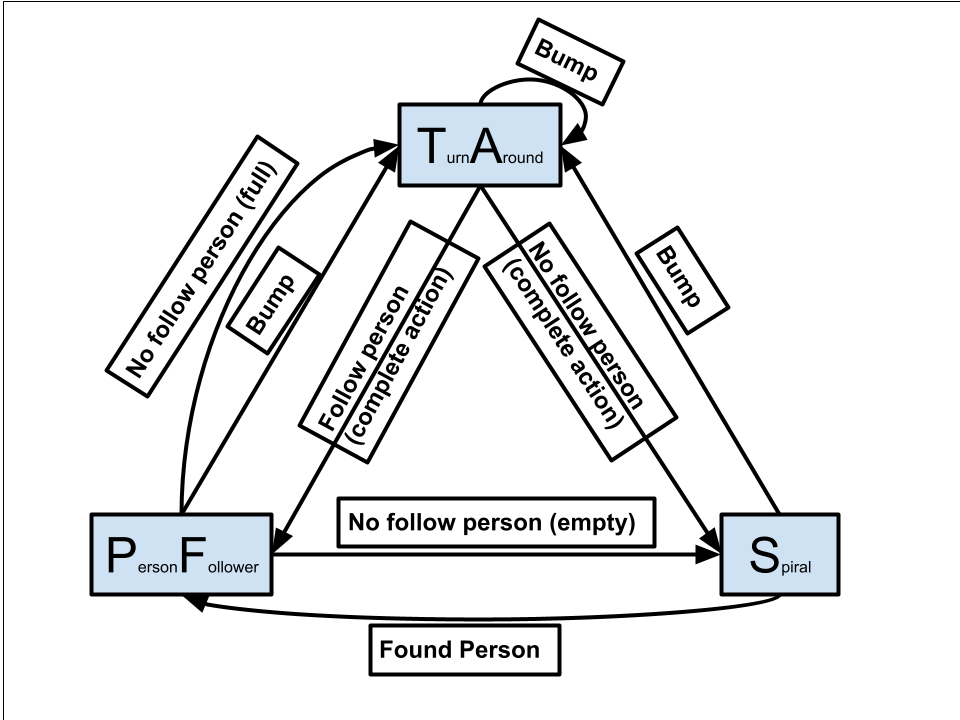

# Comprobo Warmup Project
*ENGR3590: A Computational Introduction to Robotics*

*Grant Rechtin*\
*Brenna O'Donnell*
-----------------------------------------------------------------------------------------------------------
The goal of this project is to become familiar with Ros2, the Neatos, and the systems around them that we will be using throughout this course. We started with basic driving to gather an understanding of subscribers and publishers but through this project have learned to use the lidar scanner, bump sensor, and Twist movement commands to create both teleop and autonomous movement. These behaviors were what we completed by the end.

- [Teleop Drive](#teleop-drive)
- [Drive in Circle](#drive-in-circle)
- [Wall Follower](#wall-follower)
- [Person Follower](#person-follower)
- [Turn Around](#turn-around)
- [Spiral](#spiral)
- [Finite-State Controller](#finite-state-controller)

## Teleoperation  <a name="teleoperation"></a>
### Description
This is one of out "basic" methods and was completed pretty early on in the project, making use of provided class materials. It uses the keyboard to directly control the neato, mapping Forward-W, Backward-S, Rotate Left-A, Rotate Right-D, Stop-C, Exit Program-CtrlC (/x03). This introduced us to mapping keyboard inputs to affect neato behavior, though that was not used anywhere else in the project.

### Methods
Teleop is a rather simple Node, taking keyboard input in a function we called getKey() at the start of the loop which uses the imported libraries tty, select, sys, termios to find and return a string representing the last key that the user pressed, then setting the linear and angular velocities based on what key was pressed, and finally publishing that information in a Twist message.

```Python
if key == "w":
    vel.linear.x = 0.3
    vel.angular.z = 0.0
elif key == "s":
    vel.linear.x = -0.3
    vel.angular.z = 0.0
elif key == "a":
    vel.linear.x = 0.0
    vel.angular.z = 0.3
elif key == "d":
    vel.linear.x = 0.0
    vel.angular.z = -0.3
elif key == "c":
    vel.linear.x = 0.0
    vel.angular.z = 0.0
elif key == "/x03":
    quit()
```

### Code Structure
As this node was not included in our FSM, it only has one method in addition to the init and main.

```Python
class TeleopNode(Node):
    def __init__(self):
        # Timer for motors
        # Create the publisher for cmd_vel that tells the motors to move.
        # Define getKey() settings

    def run_loop(self):
        # Define movement based on key press

    def getKey(self):
        #get string representing most recent key pressed by the user

    def main(args=None):
        #spin node
```


## Drive in Circle  <a name="drive-in-circle"></a>
### Description
Drives in a circle once over the span of 20 seconds.

### Methods
This is one of our "basic" methods and was the first created following bump stop. It utilizes the time module in python and a known angular speed of pi/10 to drive almost exactly one circle over the span of 20 seconds. This method was a good starting point as it further introduced us to publishing and subscribing, specifically with Twist for movement, as well as timing actions using the time module.

### Code Structure
As this was our first real behavior, and it was an incredibly simple one, the node only contained an init and run_loop.

```Python
class CircleNode(Node):
    def __init__(self):
        # initialize publishers:
        # - velocity status
    def run_loop(self):
        # determines and sends velocity commands to neato
def main(args=None):
    # spin node
```


## Wall Follower  <a name="wall-follower"></a>
### Description
Follows and aligns with the nearest wall on either the left or right side until front in blocked, in which case it turns in the unblocked direction.

### Methods
This was the first of the three "advanced" behaviors we completed and was loosely based off the wall follower code from Charlie and Christopher's project. At this point we had used the lidar scanner, through the `/scan` topic and `LaserScan` message type, only in the ranged stop method during class, so this was our first real look into using it. 

The data received from scan was in the form of a `1 by 361` array with each index relating to the distance from the scanner at one degree out of the 360 degree scan. We then organized this data using `numpy`, imported as `np`, and another array with integers in a range from 1-361. Using `np.where`, we first removed the distances either below 0.1 meters or above 2 meters as these are often either the neato itself or data to far away to be useful. Also with `np.where` organized the data into eight groupings:

`front_left`, `front_right`
`left`, `left_front`, `left_back`
`right`, `right_front`, `right_back`

With the `/scan` data organized we were then able to begin the logic behind the wall follower. This begins by determining which wall is closest between the left and right, which we find by comparing the means of the `left` and `right` sections of the distance array. Once the neato has determined which was it is closer it also compares the means of the front and back sections of the corresponding side. If the mean of the `left_front` section and that of the `right_front` section are not within a certain threshold of closeness, the neato isn't aligned parallel to the wall, and slight angular velocity is added to compensate for that difference. Along with this, the neato also checks to make sure the front and back sections aren't too far apart, as this often means the wall isn't long enough to cover both sections, which was something we found could cause big issues. An example of our velocity calculation code for the left side can be seen below:

```Python
elif self.lmean < self.rmean:
    if abs(self.lfmean - self.lbmean) < 0.01 or abs(self.lfmean - self.lbmean) > 0.3:
        msg.angular.z = 0.0
    else:
        msg.angular.z = float(
            self.lfmean - self.lbmean) * self.ang_vel
    self.vel_pub.publish(msg)
```

The one other aspect of the wall follower we added later on was the ability to switch walls if presented with a frontal obstruction (generally a wall). To complete this, we checked whether either the `front_left` or `front_right` sections had a smaller, and therefore closer, average distance than either left or right. In this instance we would use whether we were closer to the left or right wall to determine which way to turn. Once determined, using the same speed as in our circle behavior, a velocity of either `-pi/10` or `pi/10` was applied for 5 seconds, resulting in a 90 degree turn. The neato would then continue following this new wall until a new obstruction appears. 

### Code Structure
Despite being much more complex, the code only contained one more function which was used to receive and process scanner data as it was received by the subscriber.

```Python
class WallFollower(Node):
    def __init__(self):
        # initialize publishers:
        # - velocity status
        # initialize subscribers:
        # - lidar scanner
    def run_loop(self):
        # determines and sends velocity commands to neato
    def process_scan(self, data):
        # cut out super close and far angles
def main(args=None):
    # spin node
```

## Spiral  <a name="spiral"></a>
### Description
Spiral is the most simple node in our FSM and potentially the most simple node we made for this project. It acts as the base behavior of the FSM, where the robot will spiral only if it has nothing else to do. The spiral is expanding so at some point the robot will encounter something to interact with.
### Methods
Spiral is very straightforward. All it does is set and angular and linear velocity, and multiply the angular velocity by 0.95 each loop to make the spiral expand over time. Since it is a part of our finite state machine, it is subscribed to "state" messages. If the state message is 'spiral', self.active is set to True and the code in the loop() runs.

```Python
if msg.data == 'Spiral':
    self.active = True
elif msg.data != None and len(msg.data) > 2:
    # reset parameters
    self.active = False
    self.speed = 0.05
    self.angular_speed = 0.3
```
### Code Structure
This node follows our standard FSM format with an init(), loop(), main(), and process_state() and it has no additional methods. 
```Python
class SpiralNode(Node):
    def __init__(self):
        # Set inital velocities
        # Timer for motors
        # Initialize publisher: 'cmd_vel' of type Twist.
        # Initialize subscriber:'state' of type String

    def run_loop(self):

        #If node is active in the FSM
            #determines and sends velocity commands to Neato

    def process_state(self, msg: String):
        # update active status 


def main(args=None):
    # spin node
```

## Turn Around  <a name="turn-around"></a>
### Description
Backs up from bumped object, locates most open direction, and rotates to and travels in that direction for a predetermined amount of time

### Methods
This was one of the first two behaviors we developed specifically for the `finite-state controller`. This was also after we had made wall follower, so we had some experience with the lidar scanner at this point. This was our first time really messing with publishing and subscribing to our own topics, rather than just the built in ones. Specifically, this node subscribed to the `state` topic, which was a `String` type message published by the `controller` node to switch between states, as well as published a `Bool` type message to the `turn_complete` topic to communicate when the full process was complete.

As for the behavior itself, the main goal was to have it navigate it's way out of wherever it got itself. To this end, following a small backtrack to move away from whatever was hit, we used the lidar scanner to determine which direction was the most open. In order to find this, unlike all the `process_scan` methods in every other node, we didn't cap the max distance, and only ignored those which were too close. This did provide issues in the simulated due to the possibility of there being literally nothing to scan, so we also turned any values that returned `inf` to be replaced with `100`. With this data we then iterate through every possible 45 degree slice to determine which was the most empty, before turning to the centerpoint of that slice. This can be seen below:

```Python
max_sum = 0
self.target_angle = 0

for i in range(len(self.distances)-44):
    grouping = self.distances[i:i+45]
    self.target_angle = self.angles[i+22] if sum(
        grouping) > max_sum else self.target_angle
    max_sum = max(sum(grouping), max_sum)

self.target_angle = self.target_angle if self.target_angle <= 180 else (
    self.target_angle-360)
```

Once the `target_angle` was determined, we rotated the neato to the desired angle, this process took advantage of how we knew 10 seconds at at angular velocity of either `pi/10` or `-pi/10` would complete a pull 180 degree, or pi radians, turn. We translated the target angle into seconds of rotation with 180 corresponding to 10 full seconds, and chose either negative or positive `10/pi` depending on whether the  target angle was negative or positive. This process can be seen below:

```Python
turn_time = abs(self.target_angle / 180) * 10
msg.angular.z = pi/10 if self.target_angle > 0 else -pi/10
```

When we initially created this behavior we used the `sleep()` function after publishing the `Twist` velocity to `cmd_vel` to have it rotate for the correct time, but we discovered the limitations and issues `sleep()` has later during testing. This lead us to eventually switch to using `time()` like we did in our initial `circle` behavior.

### Code Structure
The code structure for this had a few methods past those every behavior had, mostly it's role in the finite-state machine, but also for determining the target angle to rotate to.

```Python
class TurnAroundNode(Node):
    def __init__(self):
        # initialize publishers:
        # - velocity & completion status
        # initialize subscribers:
        # - lidar scanner & finite-state machine state
    def run_loop(self):
        # determines and sends velocity commands to neato
    def find_target_angle(self):
        # finds angle to turn to
    def process_scan(self, data):
        # cut out super close angles
    def process_state(self, msg):
        # update active status 
def main(args=None):
    # spin node
```

## Person Follower  <a name="person-follower"></a>
### Description
The Person Follower was the final written of our advanced behaviors, and the most complex one, taking from both Turn Around and the Controller. Its goal is to identify and follow an isolated target object (such as a person) using the Neato’s lidar scanner. It continuously scans for clusters of nearby points, selects the closest cluster within a narrow cone, and adjusts linear and angular velocity to follow it. If the detected object is not clearly identifiable (e.g., too many objects in the scan, or nothing close enough), it publishes to the full_empty topic to inform the controller's state change logic.
### Methods
The person follower subscribes to "scan" and "state", and publishes velocity and full_empty. It gets initial scan data from process_scan, then find_target angle uses that data to find the angle corresponding to the closest 15 degree cone of points in the scan data and update self.target_angle. In the main loop, this angle is used to orient the neato around th eobject based on where the neato is in relation to the object. The check_full_empty() function also uses the scan data to see if there are too many or too few objects to pick from and publishes the boolean full_empty based on this.
### Code Structure
The code consists of the standard FSM methods plus a few helper functions for scan processing and state logic.
```Python
class PersonFollowerNode(Node):
    def __init__(self):
        #Initializes variables
        #Initializes counters for reruning code before new scan comes in
        #Create timer
        # initialize publishers:
        # - velocity and full_empty status
        # initialize subscribers:
        # - lidar scanner & finite-state machine state

    def run_loop(self):
        # find current target angle
        # only run if new scan data has come in
            # move forward if target is close to straight ahead and not currently turning, otherwise,
            # initiate a turn towards the target position by updating start_time and turn_time
            #publish velocity

    def find_target_angle(self):
        # checks every set of 15 degrees and finds the closest one to target
        #sets best angle to target angle

    def process_scan(self, data):
        #Updates distances and angles arrays to remove unnecessary scans.

    def process_state(self, msg: String):
       #Activates or deactivates person following based on state.

    def check_full_empty(self):
        #True if nearby object
        #determines if the inability to find a person is due to the area being empty or there being too many objects.
        Only called if couldn't find a person

def main(args=None):
    #spin node
```

## Finite-State Controller  <a name="finite-state-controller"></a>
<p align="center">
  
</p>

### Description
Controls the Finite State Machine. Controller checks for multiple booleans via subscriptions and its own methods, then sets the correct state to active based on these variables, then publishes the active state. 
### Methods
The controller is subscribed to scan, bump, full_empty, turn_complete, and checks for people to follow using scan. Scan and bump are "built in". full_empty comes from Person Follower and represents whether there are too many things to isolate a person out of, or not enough. turn_complete comes from Turn_around and represents whether the Turn Around behavior has been completed or not. The check_follow people() method is built upon process_scan(), taking in the relevant set of angles and seeing if there are any points withing a certain distance and whether they are all in a 45 degree cone. If so, there is a person to follow and the function returns true.
```Python
ang = self.angles
    dist = self.distances

    # check if there are any valid scan points and that they have been updated at least once
    if len(dist) > 0 and len(dist) < 361:

        # find closest point
        closest_d = sum(dist[np.where(dist == np.min(dist))]) / \
            len(dist[np.where(dist == np.min(dist))])
        dist_range = np.where((dist < closest_d+0.1))

        print(len(ang[dist_range]))

        not_front_range = np.where((ang > 45) & (ang < 315))
        not_front = dist[not_front_range]

        # check if all points are within a 45 degree cone
        if (abs(np.max(ang[dist_range]) - np.min(ang[dist_range])) <= 45) or ((np.max(ang[dist_range]) >= 315) & (np.min(ang[dist_range]) <= 45) & len(not_front) == 0):
            return True
        else:
            return False
    else:
        return False
```
In each run of loop() the node gets the most updated version of each of the booleans, then evaluates a large IF statement to determine what state the FSM is in and thus which node should be active. When the state changes, all of the relevant tracking variables reset to ensure correct state evaluation on the next loop. Below is just one of the IF statement checks.
```Python
# State transition logic based on sensor inputs
if self.state == 'Person Following' and self.bumped and abs(time() - self.bump_cooldown_start) > 2:
    # If PF but hit something, turn around.
    msg.data = 'Turn Around'
    self.state = msg.data
    self.state_publisher.publish(msg)
    self.bumped = False
    t = Twist()
    t.angular.z = 0.0
    t.linear.x = 0.0
    self.vel_publisher.publish(t)
    self.bump_cooldown_start = time()
    self.turn_complete = False
```

### Code Structure
This node consists of initialization of the node and its many variables publishers and subscribers, loop() containing the state change logic, methods for scanning/person identification, and methods to process subscription booleans.

```Python
class ControllerNode(Node):
    def __init__(self):
        # initialize publishers:
        # - state, timer, velocity
        # initialize subscribers:
        # - lidar scanner, bump sensor, too many/ not enough objects, turn around complete

        #distance and angle arrays
        # cooldown after bump to back up
        # sensor states to determine behavior
        # Set initial state (Spiral)
        #create timer

    def run_loop(self):
        # State transition logic based on sensor inputs
        # publish active state

    def process_scan(self, data):
        #Updates distances and angles arrays with detected objects.

    def check_follow_people(self):
        #Determines if there is a followable person based on laser scan data and returns True if there is.

    def process_bump(self, msg):
        #Sets bumped state if any bump sensor is triggered.

    def process_full_empty(self, msg):
        #Callback for full_empty topic which determines local boolean

    def process_turn_complete(self, msg):
        #Callback for turn_complete topic which determines local boolean


def main(args=None):
    #spin node
```

## Conclusion
### Challenges
### Improvements
### Take-aways


